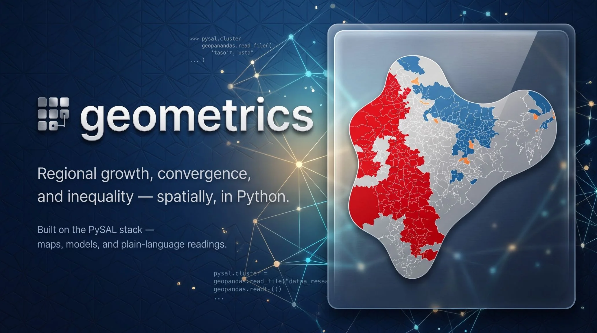

---
---

{fig-align="center" fig-alt="geometrics — regional growth, convergence, and inequality, spatially, in Python"}

::: {.text-center}
**Explore, analyze and learn regional growth, convergence and inequality — spatially, in Python.**
:::

**geometrics** turns the standard analyses of the regional convergence literature into
illustrative, easy-to-apply functions with interactive
[Plotly](https://plotly.com/python/) figures, publication-quality
[Great Tables](https://posit-dev.github.io/great-tables/), and a plain-language
reading on every result — built on the excellent [PySAL](https://pysal.org) family
(libpysal, esda, giddy, inequality, mapclassify, spreg) and
[mgwr](https://mgwr.readthedocs.io/).

```{=html}
<div class="hero-cta">
  <a class="xpd-btn xpd-btn--app" href="explore.qmd">Get started &rarr;</a>
  <a class="xpd-btn xpd-btn--ghost" href="https://colab.research.google.com/github/quarcs-lab/geometrics/blob/main/notebooks/explore.ipynb" target="_blank" rel="noopener">&#9654; Try it in Colab</a>
  <a class="xpd-btn xpd-btn--ghost" href="https://github.com/quarcs-lab/geometrics" target="_blank" rel="noopener">&#11088; Star on GitHub</a>
</div>
```

::: {.grid}

::: {.g-col-12 .g-col-md-4 .module-card}
### [🗺️ Explore](explore.qmd)
See the regional map and its structure: classified and animated **choropleths**, the
weights **connectivity graph**, Moran scatterplots, **LISA cluster maps**, and
space-time views of the whole distribution.

```{=html}
<div class="module-card__links">
  <a href="https://colab.research.google.com/github/quarcs-lab/geometrics/blob/main/notebooks/explore.ipynb" target="_blank" rel="noopener">▶ Open in Colab</a>
</div>
```
:::

::: {.g-col-12 .g-col-md-4 .module-card}
### [🧮 Analyze](analyze.qmd)
Estimate the classics: **β/σ/club convergence**, the spreg suite with **LeSage-Pace
impacts** and LM diagnostics, **Markov and spatial Markov** dynamics, **Gini/Theil**
decompositions, and GWR/MGWR local models.

```{=html}
<div class="module-card__links">
  <a href="https://colab.research.google.com/github/quarcs-lab/geometrics/blob/main/notebooks/analyze.ipynb" target="_blank" rel="noopener">▶ Open in Colab</a>
</div>
```
:::

::: {.g-col-12 .g-col-md-4 .module-card}
### [📚 Learn](learn.qmd)
See the ideas behind the methods: **11 runnable concept sandboxes** where you plant
the truth and watch the estimator recover it, a **30-topic** explainer index, and
`.interpret()` on every result.

```{=html}
<div class="module-card__links">
  <a href="https://colab.research.google.com/github/quarcs-lab/geometrics/blob/main/notebooks/learn.ipynb" target="_blank" rel="noopener">▶ Open in Colab</a>
</div>
```
:::

:::

## What's inside

**Explore** is the descriptive first pass — maps that classify honestly, a weights
graph you can inspect before trusting, global and local Moran, and ridgeline /
heatmap views of how the whole regional distribution moves through time.

**Analyze** estimates what Explore described — β-convergence with or without spatial
spillovers (OLS / SAR / SEM / SLX / SDM, read through the LeSage-Pace impact
decomposition), σ-convergence, Phillips-Sul clubs, spatially conditioned Markov
chains, inequality trends with the spatial Gini, exact Theil between/within splits,
and geographically weighted regression.

**Learn** teaches — every result interprets itself in plain, association-only
language and can explain the concept behind it, while the `learn_*` sandboxes
simulate from a known truth so the methods stop being black boxes.

### The three-input data model

| Input | What it is |
|---|---|
| `gdf` | Geometry with **only the entity ID** — shapefile, zipped shapefile, GeoJSON, or GeoPackage |
| `df` | A **long-form panel** — one row per (entity, time) |
| `df_dict` | A **data dictionary** — `var_name, var_def, label, type, role, can_be_na` |

Declared once with `set_labels(df, df_dict, set_panel=True)`, used everywhere. Every
function returns a frozen result object: `.df` (tidy frame), `.fig` (Plotly), `.gt`
(Great Tables), named scalars, `.interpret()`, `.explain()`.

### Bundled case studies

- **India** — 520 districts observed by satellite nighttime lights, 1996–2010
  ([Mendez, Kabiraj & Li](https://github.com/quarcs-lab/project2025s-py)):
  `gm.data.load_india()`
- **Bolivia** — PWT-anchored local GDP (2021 PPP US$), 2012–2022, at three scales
  ([Rossi-Hansberg & Zhang / PWT 11.0](articles/bolivia-dataset.qmd)):
  `gm.data.load_bolivia()` (112 provinces), `load_bolivia_departments()` (9),
  `load_bolivia_grid()` (1,603 cells)

## Installation

```bash
pip install geometrics                 # core
pip install "geometrics[dynamics]"     # + Markov / spatial Markov (giddy)
pip install "geometrics[streamlit]"    # + the three no-code apps
pip install "geometrics[all]"          # everything, incl. PNG export
```

Requires Python 3.11+. Bleeding edge:
`pip install "git+https://github.com/quarcs-lab/geometrics.git"`.

## At a glance

```python
import geometrics as gm

gdf, df, df_dict = gm.data.load_india()          # the bundled Indian case study
df = gm.set_labels(df, df_dict, set_panel=True)  # declare everything once

w = gm.make_weights(gdf, method="knn", k=6)
gm.explore_lisa_cluster_map(df, "ntl_total", gdf=gdf, w=w, period=2010).fig

res = gm.analyze_beta_convergence(df, "ntl_total", model="sdm", gdf=gdf, w=w)
print(res.interpret())
```

Learn as you go — plant a truth and watch it come back:

```python
gm.learn_spatial_autocorrelation(rho=0.8).fig
print(gm.explain("spatial_autocorrelation"))
```

## Built on

[libpysal](https://pysal.org/libpysal/) · [esda](https://pysal.org/esda/) ·
[giddy](https://pysal.org/giddy/) · [inequality](https://pysal.org/inequality/) ·
[mapclassify](https://pysal.org/mapclassify/) · [spreg](https://pysal.org/spreg/) ·
[mgwr](https://mgwr.readthedocs.io/) · [geopandas](https://geopandas.org) ·
[Plotly](https://plotly.com/python/) ·
[Great Tables](https://posit-dev.github.io/great-tables/)

## Acknowledgement

Developed at the [QuaRCS Lab](https://quarcs-lab.org). geometrics follows the design
language of [expdpy](https://cmg777.github.io/expdpy/) and stands on the shoulders of
the [PySAL](https://pysal.org) project. Case-study data:
[Mendez, Kabiraj & Li](https://github.com/quarcs-lab/project2025s-py);
[Rossi-Hansberg & Zhang (2026)](https://bfidatastudio.org/gdp) with
[Penn World Table 11.0](https://www.rug.nl/ggdc/productivity/pwt/). If geometrics is
useful in your research, please cite it (see
[`CITATION.cff`](https://github.com/quarcs-lab/geometrics/blob/main/CITATION.cff)).
